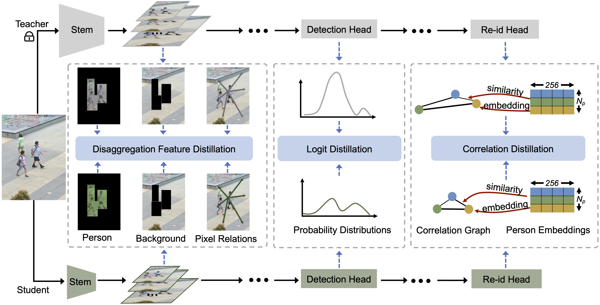
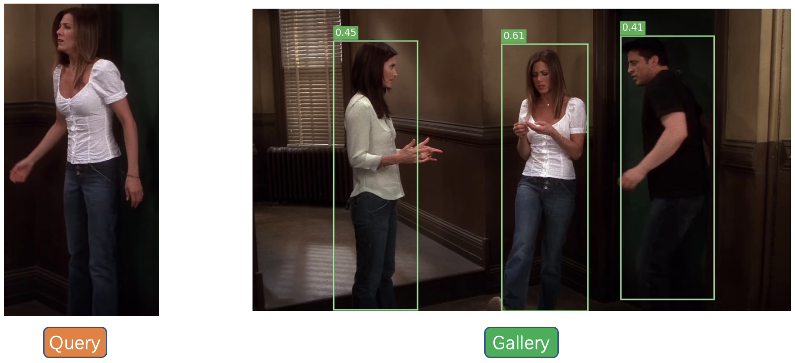

## Introduction

This is the official implementation for "Disaggregation Distillation for Person Search" in TMM 2024.

### Contributions
- We propose a novel compact and efficient person search model, namely Disaggregation Distillation for Person Search (DDPS), to distill the comprehensive knowledge from the teacher in a disaggregated manner. DDPS enhances the performance of the student by distilling from not only the task-oriented detection/re-id knowledge but also the discriminative intermediate features.
- We propose three intuitive modules to achieve the objective of disaggregation distillation. On the one hand, DFD distinctively deals with person and background regions, enabling the student to capture critical knowledge during feature distillation. On the other hand, LD and CD contribute to the task-oriented distillation to boost the ultimate person search capabilities of the student.
- Surprisingly, our compact person search models outperform the corresponding teacher models on both benchmarks.

### Overall architecture of DDPS


## Performance

|   | Dataset        | CUHK-SYSU | CUHK-SYSU | PRW   | PRW   |
|---|----------------|-----------|-----------|-------|-------|
|   | Backbone       | mAP       | Top-1     | mAP   | Top-1 |
| T | ResNet-50      | 91.96     | 92.72     | 41.43 | 79.24 |
| S | ResNet-18      | 89.96     | 91.03     | 38.50 | 77.39 |
|   | w/ DDPS        | 92.57     | 93.45     | 41.93 | 79.58 |
|   | ResNet-18(0.5) | 79.23     | 81.34     | 32.29 | 74.28 |
|   | w/DDPS         | 86.03     | 87.21     | 36.50 | 76.28 |
|   | MobileNetV2    | 89.60     | 91.00     | 39.85 | 79.97 |
|   | w/ DDPS        | 91.12     | 92.45     | 41.78 | 80.21 |


## Installation

``` bash
conda create -n ddps python=3.8 -y && conda activate ddps
pip install -r requirements.txt
```


## Quick Start

Let's say `$ROOT` is the root directory.

1. Download [CUHK-SYSU](https://drive.google.com/open?id=1z3LsFrJTUeEX3-XjSEJMOBrslxD2T5af) and [PRW](https://goo.gl/2SNesA) datasets, and unzip them to `$ROOT/data`
```
$ROOT/data
├── CUHK-SYSU
└── PRW
```
2. Following the link in the above table, download our pretrained model to anywhere you like, e.g., `$ROOT/exp_cuhk`
3. Run an inference demo by specifing the paths of checkpoint and corresponding configuration file. `python demo.py --cfg $ROOT/exp_cuhk/config.yaml --ckpt $ROOT/exp_cuhk/epoch_19.pth` You can checkout the result in `demo_imgs` directory.



## Execution Instructions

### Training

1. Training the teacher model with ResNet-50 as the backbone.

``` bash
bash job_train_base.sh
```

2. Training the student model with the teacher and our proposed DDPS method.

``` bash
bash job_train_ddps.sh
```

### Test

Suppose the output directory is `$ROOT/exp_cuhk`. Test the trained model:

```
python train_ddps.py --cfg $ROOT/exp_cuhk/config.yaml --eval --ckpt $ROOT/exp_cuhk/epoch_19.pth
```

## Acknowledge
Thanks to the solid codebase from [SeqNet](https://github.com/serend1p1ty/SeqNet).
